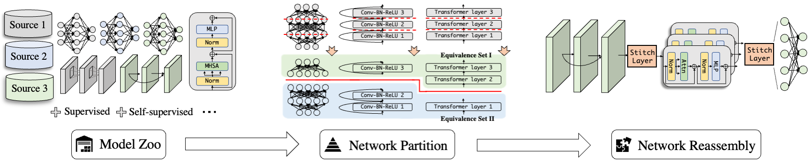

# Deep Model Reassembly  🏭 -> 🧱 -> 🏭
## 😎 Introduction
This repository contains the offical implementation for our paper

**Deep Model Reassembly** (NeurIPS2022)

[[arxiv](https://arxiv.org/abs/2210.17409)] [[project page](https://adamdad.github.io/dery/)]
 [[code](https://github.com/Adamdad/DeRy)]

*Xingyi Yang, Daquan Zhou, Songhua Liu, Jingwen Ye, Xinchao Wang*

> In this work, we explore a novel knowledge-transfer task, termed as Deep Model Reassembly (*DeRy*), for general-purpose model reuse. *DeRy* first dissect each model into distinctive building blocks, and then selectively reassemble the derived blocks to produce customized networks under both the hardware resource and performance constraints.



- [x] 2022/12/07 Code Updated for better usage.

## 📚 File Orgnization

```
DeRy/
├── blocklize/block_meta.py         [Meta Information & Node Defnition]

├── similarity/
│   ├── get_rep.py                  [Compute and save the feature embeddings]
│   ├── get_sim.py                  [Compute representation similarity given the saved features]
|   ├── partition.py                [Network partition by cover set problem]
|   ├── zeroshot_reassembly.py      [Network reassembly by solving integer program]

├── configs/
|   ├── compute_sim/                [Model configs in the model zoo to compute the feature similarity]
|   ├── dery/XXX/$ModelSize_$DataSet_$BatchSize_$TrainTime_dery_$Optimizor.py   [Config files for transfer experiments]

├── mmcls_addon/
|   ├── datasets/                   [Dataset definitions]
|   ├── models/backbones/dery.py    [DeRy backbone definition]

├── third_package/timm              [Modified timm package]
```
    

## 🛠 Installation
The model training part is based on [mmclassification](https://github.com/open-mmlab/mmclassification). Some of the pre-trained weights are from [timm](https://github.com/rwightman/pytorch-image-models/tree/master/timm).

    # Create python env
    conda create -n open-mmlab python=3.8 pytorch=1.10 cudatoolkit=11.3 torchvision -c pytorch -y
    conda activate open-mmlab

    # Install mmcv and mmcls
    pip3 install openmim
    mim install mmcv-full==1.4.8
    mim install mmcls==0.18.0

    # Install timm
    pip3 install timm


**Note**: Our code needs `torch.fx` to support the computational graph extraction from the torch model. Therefore, please install the `torch > 1.10`.


## 🚀 Getting Started
To run the code for *DeRy*, we need to go through 4 steps

1. [**Model Zoo Preparation**] Compute the model feature embeddings and representation similarity. We first write model configuration and its weight path, and run the configs in `configs/compute_sim`
            
        PYTHONPATH="$PWD" python simlarity/get_rep.py \
        $Config_file \              # configs in `configs/compute_sim`
        --out $Feature_path \       # Save feature embeddings in *.pth* files
        [--checkpoint $Checkpoint]  # download checkpoint if any

    All feature embeddings need to be saved in *.pth* files in the same $Feat_dictionary. We then load them and compute the feature similarity. Similarity will be saved as *net1.net2.pkl* files.

        PYTHONPATH="$PWD" python simlarity/compute_sim.py /
        --feat_path $Feat_dictionary /
        --sim_func $Similarity_function [cka, rbf_cka, lr]

    Pre-computed similarity on ImageNet for [Linear CKA](https://drive.google.com/drive/folders/1ebSVwZyKeHdmdOdVlFZF6P9_1PzEMs-J?usp=share_link) and [Linear Regression](https://drive.google.com/drive/folders/1rKmV3iQwETKBO3yYlsXFIxrPfAc7VRRb?usp=share_link).

    We also need to compute the feature size (input-output feature dimensions). It can be done by running

        PYTHONPATH="$PWD" python simlarity/count_inout_size.py /
        --root $Feat_dictionary

    The results is a json file containing the input-output shape for all network layers, like [MODEL_INOUT_SHAPE.json](https://drive.google.com/file/d/15xDgYOu8Gs866faNHEYI0iHCJkxl-M2h/view?usp=share_link).

2. [**Network Partition**] Solve the cover set optimization to get the network partition. The results is an assignment file in *.pkl*.

        PYTHONPATH="$PWD" python simlarity/partition.py /
        --sim_path $Feat_similarity_path /
        --K        $Num_partition /             # default=4
        --trial    $Num_repeat_runs /           # default=200
        --eps      $Size_ratio_each_block /     # default=0.2
        --num_iter $Maximum_num_iter_eachrun    # default=200

3. [**Reassemby**] Reassemble the partitioned building blocks into a full model, by solving a integer program with training-free proxy. The results are a series of model configs in *.py*.

        PYTHONPATH="$PWD" python simlarity/zeroshot_reassembly.py \
        --path          $Block_partition_file [Saved in the partition step] \
        --C             $Maximum_parameter_num \
        --minC          $Minimum_parameter_num \
        --flop_C        $Maximum_FLOPs_num \
        --minflop_C     $Minimum_FLOPs_num \
        --num_batch     $Number_batch_average_to_compute_score \
        --batch_size    $Number_sample_each_batch \
        --trial         $Search_time \
        --zero_proxy    $Type_train_free_proxy [Default NASWOT] \
        --data_config   $Config_target_data

4. [**Fune-tuning**] Train the reassembled model on target data. You may refers to [mmclassification](https://github.com/open-mmlab/mmclassification) for the model training.

**Note**: Partitioning and reassembling results may not be identical because of the algorithmatic stochaticity. It may slightly affect the performance.
 
## 🚛 Other Resources
1. We use several pre-trained models not included in timm and mmcls, listed in [Pre-trained](assets/pre-trained.md).

## Thanks for the support
[](https://github.com/Adamdad/DeRy/stargazers)

## ✍ Citation

```bibtex
@article{yang2022dery,
    author    = {Xingyi Yang, Daquan Zhou, Songhua Liu, Jingwen Ye, Xinchao Wang},
    title     = {Deep Model Reassembly},
    journal   = {NeurIPS},
    year      = {2022},
}
```
# Extensions
1. Extension on **Efficienr and Parallel Training**: [Deep-Incubation](https://arxiv.org/abs/2212.04129)
2. Extension for **Efficient Model Zoo Training**:  [Stitchable Neural Networks](https://arxiv.org/abs/2302.06586)

